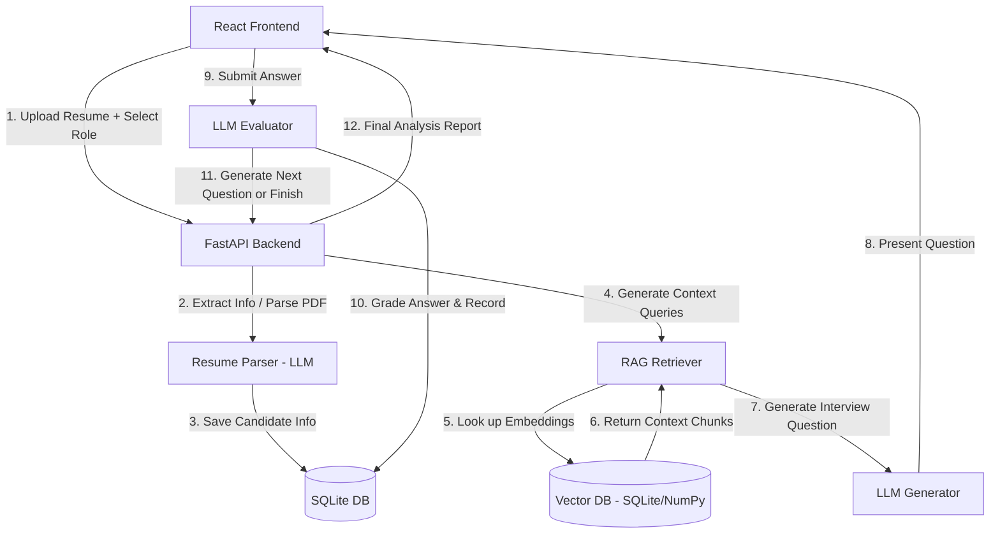

# AI-Powered Role-Based Candidate Screening System

This implementation plan outlines the development of a real-world, intelligent system that conducts structured technical interviews. The system dynamically generates interview questions based on the candidate's resume, the selected job role, and a role-specific vector database (RAG) loaded with core textbooks.

---

## User Review Required

> [!IMPORTANT]
> **API Key Requirements:**
> The system requires an `OPENAI_API_KEY` for resume parsing, embedding generation, question generation, and candidate answer evaluation. We have verified that `OPENAI_API_KEY` is present in the environment variables.

> [!NOTE]
> **Pre-loaded Knowledge Base & Document parser:**
> To ensure the system is functional out-of-the-box, we will provide a pre-seeded set of core technical chapters (as Markdown text files) representing key concepts from the requested books (Tom Mitchell, Burkov, Jason Brownlee, etc.).
> We will also implement a full ingestion pipeline (`/api/admin/ingest`) that allows uploading and parsing custom PDF textbooks.

---

## Proposed Architecture

---

## Proposed Changes

We will organize the code into a monorepo structure:
- `backend/` - FastAPI, SQLAlchemy models, LLM pipelines, RAG store.
- `frontend/` - React + Vite, styled using modern Vanilla CSS with glassmorphism and smooth animations.
- `data/` - For storing SQLite databases and raw documents.

### 1. Database Schema (`backend/app/db.py`)
We will use SQLAlchemy and SQLite to store structured records.

#### `sessions` Table
- `id` (UUID, PK)
- `candidate_name` (Text)
- `candidate_email` (Text)
- `target_role` (Text)
- `resume_text` (Text)
- `extracted_skills` (JSON)
- `current_question_number` (Integer)
- `status` (Text: 'pending', 'interviewing', 'completed')
- `created_at` (DateTime)
- `evaluation_report` (JSON)

#### `qa_records` Table
- `id` (Integer, PK)
- `session_id` (UUID, FK)
- `question_number` (Integer)
- `question_text` (Text)
- `context_retrieved` (Text)
- `candidate_answer` (Text)
- `evaluation_score` (Float)
- `evaluation_feedback` (Text)
- `created_at` (DateTime)

#### `knowledge_base` Table
- `id` (Integer, PK)
- `chunk_text` (Text)
- `file_name` (Text)
- `role_type` (Text: 'ai_ml', 'data_science', 'backend')
- `embedding` (BLOB) - binary representation of OpenAI embedding vector
- `created_at` (DateTime)

---

### 2. Backend Implementation

#### [NEW] `backend/app/config.py`
Reads settings from environment variables (e.g. `OPENAI_API_KEY`, SQLite connection string, chunk sizes).

#### [NEW] `backend/app/db.py`
Sets up the SQLite database and SQL Alchemy models.

#### [NEW] `backend/app/parser.py`
Handles resume parsing using `PyPDF2` (for PDF resumes) and processes text formatting. Uses `gpt-4o-mini` with structured JSON output to extract:
- Primary skills
- Key technologies
- Years of experience / domain exposure
- Recommended evaluation topics

#### [NEW] `backend/app/rag.py`
- Implements text chunking (500–1000 characters with 100 character overlap).
- Integrates OpenAI Embeddings (`text-embedding-3-small`).
- Implements cosine similarity retrieval directly in Python over embeddings stored in the SQLite DB (fast, reliable, and requires zero external database dependencies on Windows).
- Provides ingestion logic for processing uploaded books or text files.

#### [NEW] `backend/app/llm.py`
- **Question Generation**: Formulates customized questions. Takes into account:
  - Selected role (AI/ML Engineer, Data Scientist, Backend Engineer).
  - Resume skills (focusing on testing claimed skills or exploring gaps).
  - Retrieved context from the core books (grounded RAG).
  - Interview history (adaptive difficulty, building on top of previous responses).
- **Answer Evaluation**: Reviews candidate answers against the retrieved textbook context. Generates:
  - Score (0.0 to 10.0)
  - Detail feedback (strengths, areas of improvement)
  - Traceability linkage (referencing which textbook concept was evaluated)
- **Final Report Generation**: Synthesizes the interview records into a comprehensive analysis.

#### [NEW] `backend/app/main.py`
Exposes the REST API using FastAPI.

**API Endpoints:**
- `POST /api/resume/upload` - Extract resume info
- `POST /api/interview/start` - Initialize session
- `GET /api/interview/session/{id}` - Fetch session status
- `POST /api/interview/answer` - Submit answer and get next question
- `POST /api/admin/ingest` - Admin endpoint to upload/process knowledge books
- `GET /api/admin/status` - Checks vector store database sizes

---

### 3. Frontend Implementation (`frontend/`)

We will create a clean single-page app utilizing a state-machine logic to guide candidates through:
1. **Welcome & Upload**: Sleek file drop zone for resumes, job role selection (AI/ML Engineer, Backend Engineer, Data Scientist), and Candidate profile info.
2. **Resume Review**: Beautiful loading state showing extraction in progress, followed by a chip-based preview of extracted skills.
3. **Interview Panel**: Conversational, card-based interface showing the generated question, custom answer editor, character count, an interactive progress tracker, and a button to submit.
4. **Summary & Analytics Dashboard**: After 5 questions, the candidate sees:
   - Overall competency rating (radar/bar chart styling).
   - Topic-wise analysis (e.g. Math foundations, Systems, Coding, etc.).
   - Detailed history showing: Question, Selected Context reference, Candidate Answer, and AI evaluator's critique.

#### Style Guidelines:
- Sleek modern dark mode (deep indigo/slate colors).
- High visual polish with glassmorphic cards (`backdrop-filter: blur()`).
- Smooth micro-animations for transitions between screens.
- Completely responsive layout.

---

## Verification Plan

### Automated Verification
- We will write a Python test script (`tests/verify_system.py`) that runs the full end-to-end flow:
  1. Uploads a mock resume.
  2. Submits answers to generated questions.
  3. Verifies that evaluations are successfully stored in SQLite.
  4. Fetches and parses the final analysis report.

### Manual Verification
- We will run the frontend and backend locally.
- We will use the browser subagent to interactively verify the UI, resume upload flow, interview questions, and result reporting screen. We will record this interaction as a video artifact.
